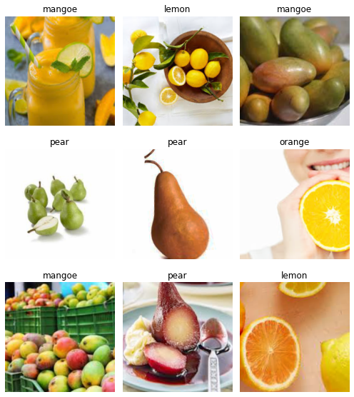
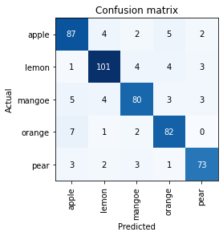

# FRUITS CLASSIFIER
This is a classifier that can identify different fruits.

* Built a a classifier that can distinguish between apples, pears, mangoes and lemons with over **90%** accuracy.
* Scrapped up to 5000 images of apples, pears, mangoes and lemons from google, here are examples of the images scrapped

* Built a **Convolution Neural Network (CNN)** using fastai library

* The trained model is productionized using **Starlet** 

